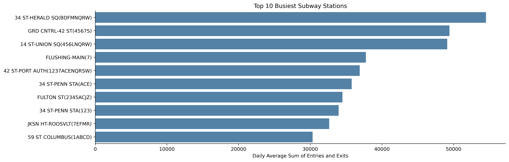
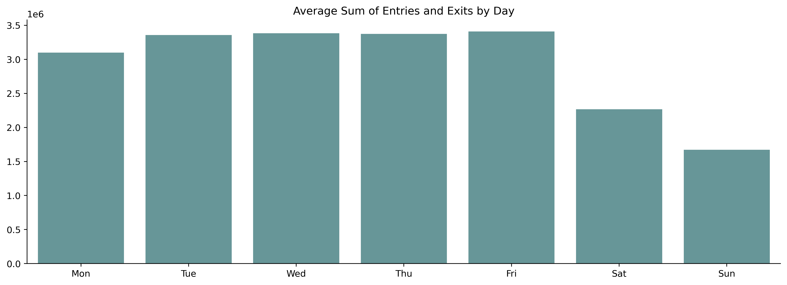
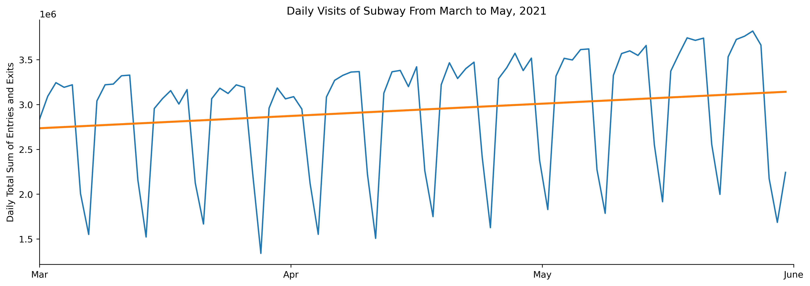

## Analysis of the Station and Daily Level
###### By Chien Yuan Chang

The goal of this project is to identify the busiest subway entrances and hours among MTA stations in New York City with the highest entires and exits between March and May in 2021 for the client, WomenTechWomenYes (WTWY).

To start exploring this goal, I used SQLite3 and Python SQLAlchemy and Pandas to ingest, store and clean the data and then Python Pandas, Matplotlib and Seaborn to analyze and visualize the data at the station and daily level. 

* The above figure of the "Top 10 Busiest Subway Stations" shows the top 10 stations with the highest daily average visits including both entires and exits between March and May in 2021. The 34th Street–Herald Square Station had the highest traffic, followed by Grand Central–42nd Street Station and 14th Street–Union Square station. These busiest stations will be the priorities to go. 

* The above figure of the "Average Visits by Day" shows the daily average visits of the 7 days of the week between March and May in 2021. The weekdays had higher traffic than the weekends. There were slightly more traffic on Fridays and slightly less traffic on Mondays among weekdays. WTWY can consider putting more resources on weekdays.

* The above figure of the "Daily Visits of Subway From March to May, 2021" shows the daily total visits of all subway stations between March and May in 2021. It also shows the weekdays had higher traffic than the weekends with slightly increasing trend by time. WTWY can consider putting more resources when it's closer to the Summer.

There may be multiple control areas in a station, and each WTWY team will be placed at a specific control area in a station at a specific time period. The next steps will be applying the similar data analysis methods to smaller levels at control areas, the parts of the days, and the days of the week to achieve the goal of this project. 