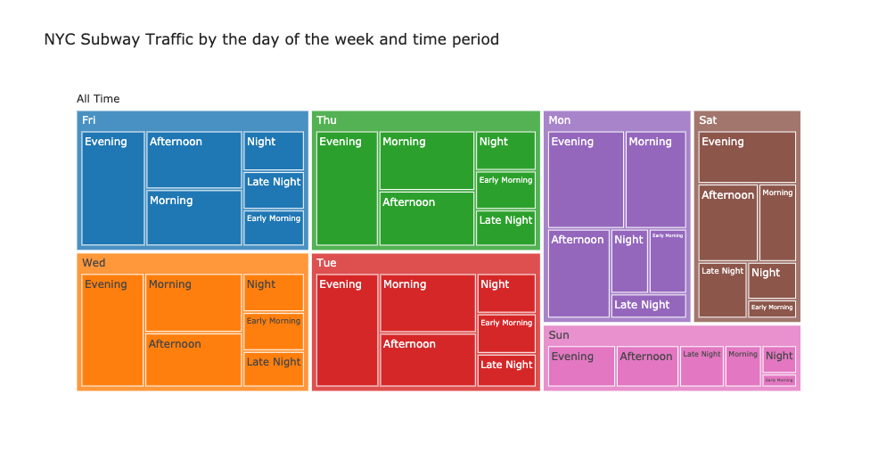
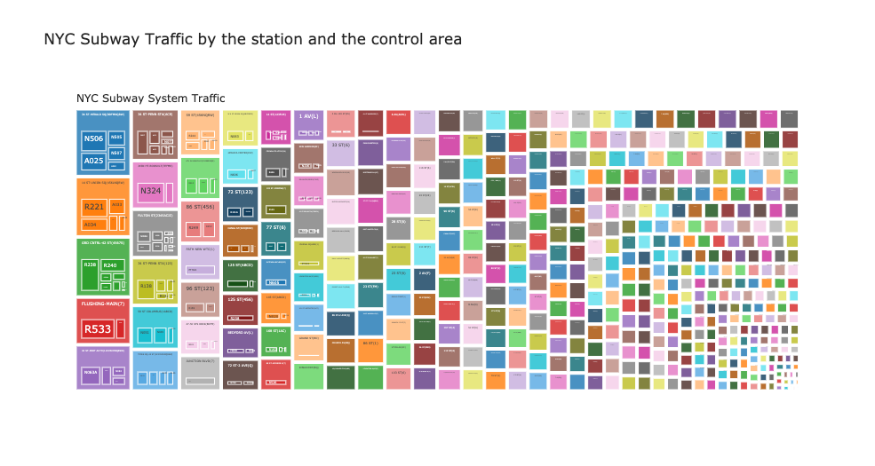

# Metis_Module1_EDA_Project
## Exploratory Data Analysis of MTA turnstile data

This is the first project of Metis Data Science Bootcamp. We're going to utilize Exploratory Data Analysis on [MTA turnstile data](http://web.mta.info/developers/turnstile.html) to understand the best way to place street teams at entrances to subway stations.

***
[Project Proposal](project_proposal.md)
***
[MVP](mvp.md)
***
[Presentation Slides](final_presentation.pdf)

[Project Writeup](project_writeup.md)

[Final Codes](codes/mta_eda_9_final.ipynb)

***
[Codes](codes/)

[Charts](images/)
***
*Bonus*

